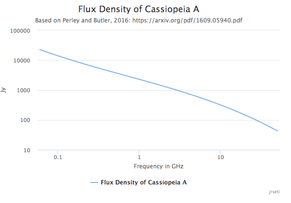

# FluxDensities

Calculates the flux densities of 20 sources as described in 
Perley and Butler, 2016: https://arxiv.org/pdf/1609.05940.pdf

This code basically uses the coefficients defined in Perley and 
Butler's paper and performs the following to calculate the flux.
Note that νG is the frequency in GHz.

log(S) = a0 + a1 log(νG) + a2[log(νG)]2 + a3[log(νG)]3 + · · ·

This project is also an exercise in creating a data set and also
displaying the data as an interactive graph, automatically popping 
up a new page in the user's default browser.

Highcharts (https://www.highcharts.com/) is used to create the graph.

The following sources can be specified:

* J0133-3629
* 3C48
* Fornax A
* 3C123
* J0444-2809
* 3C138
* Pictor A
* Taurus A
* 3C147
* 3C196
* Hydra A
* Virgo A
* 3C286
* 3C295
* Hercules A
* 3C353
* 3C380
* Cygnus A
* 3C444
* Cassiopeia A

## Example:

./flux_densities.py Cassiopeia A

This interactive graph should pop up in your browser:

  
./flux_densities.py 3c48 produces:

